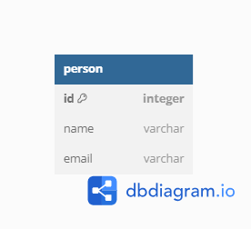

# Node.js and MongoDb CRUD API

This is a simple CRUD (Create, Read, Update, Delete) API built with Node.js and MongoDb for managing user records.

## Table of Contents

- [Prerequisites](#prerequisites)
- [Getting Started](#getting-started)
  - [Installation](#installation)
  - [Database Setup](#database-setup)
- [API Endpoints](#api-endpoints)
  - [Create User](#create-user)
  - [Retrieve User](#retrieve-user)
  - [Retrieve All Users](#retrieve-all-users)
  - [Update User](#update-user)
  - [Delete User](#delete-user)
- [Usage](#usage)
- [Contributing](#contributing)
- [License](#license)

## Prerequisites

Before you begin, ensure you have met the following requirements:

- Install Node.js installed (version >= 14.20.1)
- Install MongoDb
-

## Getting Started

### Installation

1.  Clone this repository:

    ```bash
    git clone https://github.com/TubbySparks/secondzuritask

    ```

2.  Install dependencies
    npm install
3.  Database Setup
    Create a MongoDb database for your project.

            
4.  Start the Node.js server:
    node app.js

    API Endpoints
    Create User
    URL: /api/person
    Method: POST
    Request Body: JSON object with name and email fields.
    Response: JSON object with a success message and the created user's name.

    Retrieve User
    URL: /api/person/:name
    Method: GET
    Response: JSON object with user details based on the provided name.

    Retrieve All Users
    URL: /api/person
    Method: GET
    Response: JSON array containing all user records.

    Update User
    URL: /api/person/:name
    Method: PUT
    Request Body: JSON object with updated email field.
    Response: JSON object with a success message and the updated user's name.

    Delete User
    URL: /api/person/:name
    Method: DELETE
    Response: No content (204) on successful deletion.

5.  This is the UML Diagram
    

    Usage
    Use a tool like Postman or HoppScotch to make HTTP requests to the API endpoints.
    Replace your-hostname, your-username, your-password, and your-database in the MySQL connection settings with your own database details.
    Customize the routes, error handling, and schema according to your project requirements.
